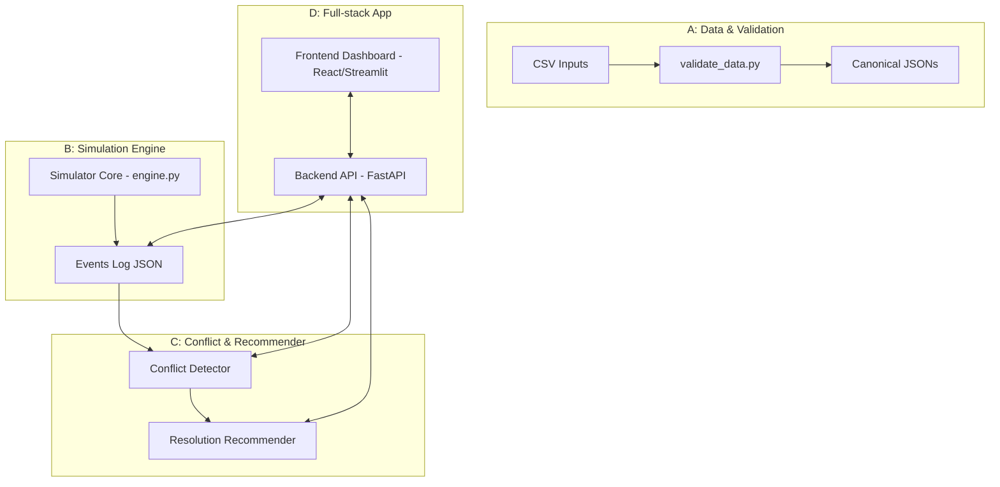

# 🚆 Project NIYANTRAK 
### An Explainable AI Decision-Support System for Train Conflict Detection & Resolution in Indore Division  

[](https://www.python.org/)  
[](https://fastapi.tiangolo.com/)  
[](https://reactjs.org/)  
[](https://pandas.pydata.org/)  
[](https://developers.google.com/optimization)  
[](https://streamlit.io/)  

Project **NIYANTRAK** is a full-stack simulation and optimization tool for Indian Railways.  
It simulates trains in the **Indore–Ujjain–Dewas corridor**, detects operational conflicts, and recommends safe, explainable resolution actions.  
Built for **Smart India Hackathon 2025**.  

---

## Table of Contents
* [About The Project](#about-the-project)  
* [Key Features](#key-features)  
* [System Architecture](#system-architecture)  
* [Getting Started](#getting-started)  
* [Project Structure](#project-structure)  

---

## About The Project

Controllers today face unpredictable conflicts: multiple trains converging on the same section, blocked junctions, or platform clashes.  
Existing tools show delays but rarely **recommend safe actions**.  

NIYANTRAK is built with a philosophy of:  
**"Decision-Support, not Decision-Replacement."**  
It suggests explainable, rule-based fixes that operators can trust, while respecting signalling and ATP safety.  

---

## Key Features  

**Time-Space Simulation:** Discrete-time simulator (30s–60s ticks) with real section speeds, dwell times, and block occupancy.  

**Conflict Detection:** Detects section, platform, and junction conflicts in lookahead windows with severity scoring.  

**Resolution Recommender:** Suggests safe actions (hold, loop, platform swap) with clear impact metrics (delay saved, trains affected).  

**Explainable Output:** Every recommendation comes with a one-line justification so operators know *why* it’s suggested.  

**Frontend Dashboard:** Interactive React + Tailwind UI with map view, time–space diagram, conflict panel, and KPIs.  

---

## System Architecture


---

## Getting Started  

### 📋 Prerequisites
- [Python 3.10+](https://www.python.org/downloads/)  
- [Node.js v18+](https://nodejs.org/)  

### ⚙️ Backend Setup  

```powershell
# In root/
python -m venv venv

.\venv\Scripts\activate

pip install -r requirements.txt

// uvicorn main:app --reload --port 8000 (leave this for now)
```
Test:
http://localhost:8000/ping → {"msg": "Backend alive"}

---

### ⚙️ Frontend Setup 
```powershell
# In frontend/
npm install
npm run dev
```
Test:
http://localhost:5173 → Indore Rail AI Dashboard

---


### 🛠 Data Validation (Phase 1)
```powershell
python scripts\validate_data.py
Get-Content data\reports\data_quality_report.md
```
Produces canonical JSONs in data/canonical/.

Reports platform/length mismatches and other quality issues.

---

### 🚂 Simulation (Phase 2)
```powershell
python simulator\engine.py
```

Outputs:
```powershell
outputs/logs/<runid>_events.json → sequence of train events.
```
Example:
```powershell
{"time": "00:05", "train_id": "EX001", "event": "enter_section", "section_id": "S12"}
{"time": "00:25", "train_id": "EX001", "event": "exit_section", "section_id": "S12"}
```
---

## Project Structure
```
indore-ai-rail-sim/
│
├── backend/            # FastAPI backend (conflict detection + recommender)
│   ├── api/            # API endpoints
│   ├── sim/            # backend-facing sim integration
│   ├── opt/            # optimization models
│   ├── rules/          # precedence & safety rules
│   ├── data/           # CSV inputs
│   └── main.py         # FastAPI entrypoint
│
├── frontend/           # React + Tailwind dashboard
│   ├── public/
│   ├── src/
│   │   ├── components/ # KPIs, Map, Alerts
│   │   ├── views/      # Pages
│   │   └── App.tsx
│   └── package.json
│
├── simulator/          # Core engine
│   ├── engine.py
│   └── __init__.py
│
├── scripts/            # Helper scripts
│   └── validate_data.py
│
├── data/
│   ├── raw/            # CSVs
│   ├── canonical/      # Normalized JSONs
│   └── reports/        # Data quality report
│
├── outputs/
│   └── logs/           # Simulation run logs
│
├── .gitignore
├── README.md
└── requirements.txt
```

 ## Verification Checklist

*   [x] Data validator runs and produces reports.  
*   [x] Simulator runs and creates event logs.  
*   [ ] Backend `/ping` works.  
*   [ ] Frontend dashboard renders.  
*   [ ] Conflict detector integrated.  
*   [ ] Recommender actions visible in UI.  


